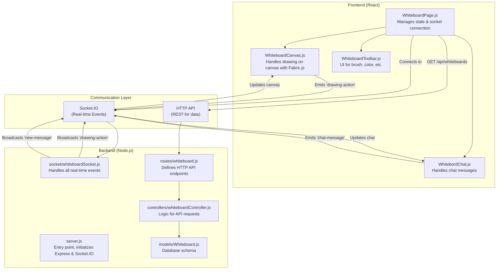

# doubleDoodle

A modern React-based frontend application for a WebRTC collaboration platform featuring video calls and interactive whiteboard functionality, with a separate Express.js backend for authentication.

## 🚀 Features

### Frontend
- **User Authentication**: Login and signup functionality with form validation
- **Responsive Design**: Clean, modern UI built with Tailwind CSS
- **Protected Routes**: Authentication-based routing with automatic redirects
- **Dashboard**: Central hub for accessing collaboration tools
- **WebRTC Ready**: Prepared for video call and whiteboard integration
- **State Management**: Context-based authentication state management

### Backend
- **User Authentication**: Register, login with JWT tokens
- **MongoDB Integration**: User data storage with Mongoose
- **Password Security**: Bcrypt password hashing
- **Input Validation**: Express-validator for request validation
- **Security**: Helmet, CORS, and error handling

## 🖼️ Screenshots

<p align="center">
  
  
</p>

<p align="center">
  
  
</p>

## 🛠️ Tech Stack

### Frontend
- **React 18** - UI library
- **React Router DOM v6** - Client-side routing
- **Tailwind CSS** - Utility-first CSS framework
- **Context API** - State management

### Backend
- **Node.js** - Runtime environment
- **Express.js** - Web framework
- **MongoDB** - Database (MongoDB Atlas)
- **Mongoose** - MongoDB ODM
- **JWT** - Authentication tokens
- **Bcryptjs** - Password hashing

## 📁 Project Structure

```
webrtc/
├── src/                    # Frontend React source code
│   ├── components/         # Reusable UI components
│   ├── context/           # React Context providers
│   ├── pages/             # Page components
│   ├── services/          # API service layer
│   └── ...
├── backend/               # Backend Express server
│   ├── models/           # Database models
│   ├── controllers/      # Route controllers
│   ├── middleware/       # Custom middleware
│   ├── routes/          # API routes
│   └── server.js        # Main server file
├── public/               # Static files
└── package.json          # Frontend dependencies
```

## 🚀 Getting Started

### Prerequisites

- Node.js (v14 or higher)
- npm or yarn
- MongoDB Atlas account (for backend)

### Frontend Setup

1. **Install dependencies:**
   ```bash
   npm install
   ```

2. **Start development server:**
   ```bash
   npm start
   ```

3. **Build for production:**
   ```bash
   npm run build
   ```

The frontend will run on `http://localhost:3000`

### Backend Setup

1. **Navigate to backend directory:**
   ```bash
   cd backend
   ```

2. **Install dependencies:**
   ```bash
   npm install
   ```

3. **Configure environment variables:**
   - Update `backend/config.env` with your MongoDB Atlas credentials
   - Set your JWT secret

4. **Start development server:**
   ```bash
   npm run dev
   ```

The backend will run on `http://localhost:5000`

## 📡 API Endpoints

### Authentication
- `POST /api/auth/register` - User registration
- `POST /api/auth/login` - User login
- `GET /api/auth/me` - Get current user (protected)
- `GET /api/health` - Server health check

## 🔧 Environment Variables

### Backend (.env)
```env
PORT=5000
MONGODB_URI=your_mongodb_atlas_connection_string
JWT_SECRET=your_jwt_secret
JWT_EXPIRE=7d
NODE_ENV=development
```

## 🎯 Usage

1. **Start both servers** (frontend and backend)
2. **Open browser** to `http://localhost:3000`
3. **Register** a new account or **login** with existing credentials
4. **Access dashboard** with collaboration tools

## 🔒 Security Features

- Password hashing with bcrypt
- JWT token authentication
- Input validation and sanitization
- CORS configuration
- Security headers with Helmet

## 🚀 Deployment

### Frontend
```bash
npm run build
```
Deploy the `build` folder to your hosting service.

### Backend
```bash
npm start
```
Deploy to platforms like Heroku, Railway, or DigitalOcean.

## 🤝 Contributing

1. Fork the repository
2. Create a feature branch
3. Make your changes
4. Submit a pull request

## 📄 License

This project is licensed under the MIT License.

## 🏗️ Architecture Diagram

Here is a diagram illustrating how the frontend and backend files for the whiteboard functionality work together.




## 🔮 Future Enhancements

- [ ] WebRTC video call implementation
- [ ] Interactive whiteboard functionality
- [ ] Real-time chat features
- [ ] Screen sharing capabilities
- [ ] File sharing and collaboration
- [ ] Team and room management
